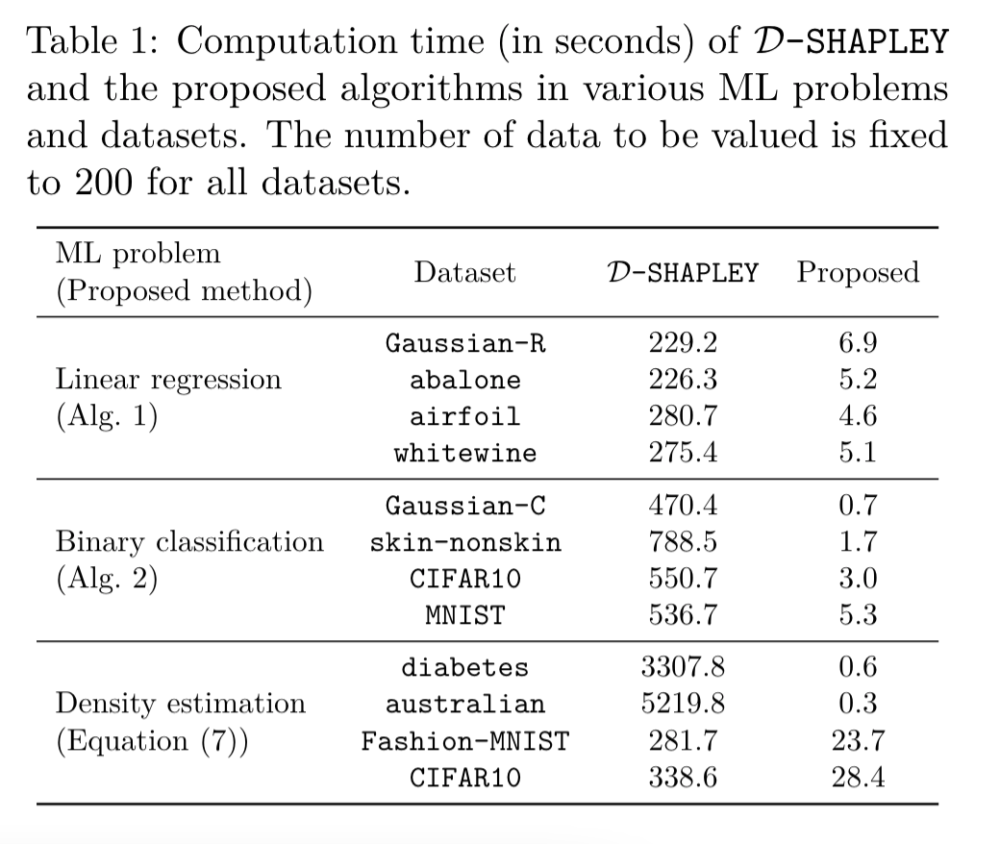

## Efficient Computation and Analysis of Distributional Shapley Values

This repository provides the Python implementation of the paper "Efficient Computation and Analysis of Distributional Shapley Values" accepted at [AISTATS 2021](https://aistats.org/aistats2021). We derive the first analytic expressions for the distributional Shapley value (DShapley) for the canonical problems of linear regression, binary classification, and non-parametric density estimation. These analytic forms provide new algorithms to estimate DShapley that are **several orders of magnitude faster** than previous state-of-the-art methods.

### Time comparison analysis in various machine learning problems


## Quick start

The following code will execute one run of the time comparison experiment in Fig. 1. 
```
python run_time_comparison.py --DShapley_flag
```
This will conduct one experiment when `(m,p)=(100,10)`.

As for the point addition experiment, you may need to download datasets first. You can download non-regression datasets with the following code (And please see comments in `data.py`).
```
python prep_non_reg_data.py
```
After that you can run all experiments introduced in the paper. One example is as follows.
```
run_point_addition_exp.py
``` 
For more experiments, please see arguments in the `run_point_addition_exp.py` file.

**Remark** You may need to run experiments multiple time to reproduce results in the paper (please change the `run_id` argument). 

## A directory tree 

```
.
├── data.py
├── dist_shap.py (original algorithm for estimating DShapley)
├── fast_dist_shap.py (proposed fast alogrithm for estimating DShapley)
├── prep_non_reg_data.py
├── run_point_addition_exp.py
├── run_time_comparison.py
├── README.md
└── shap_utils.py
```

- `dist_shap.py` and `shap_utils.py` provide the original Monte Carlo-based estimation methods proposed by Ghorbani et al. (2020). The two python files are from [this repository](https://github.com/amiratag/DistributionalShapley).
-  `fast_dist_shap.py` is the core file to efficiently compute DShapley.
- `data.py` is to load datasets.

## Reference

- Ghorbani, Amirata, Michael Kim, and James Zou. "A distributional framework for data valuation." International Conference on Machine Learning. PMLR, 2020.


